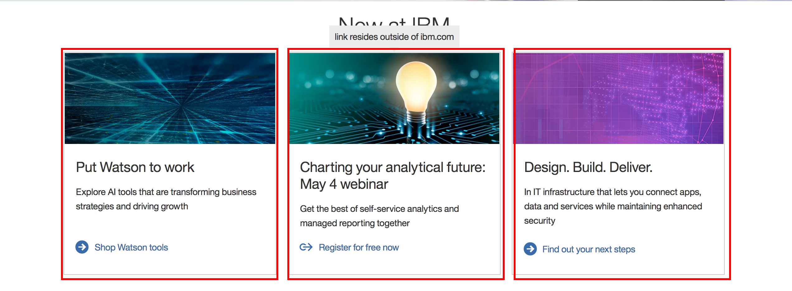

# Pre-requisites

## 1. Install Node.js and NPM

[Node.js](https://nodejs.org/en/download/current/)

## 2. Install Create React App

`npm i -g create-react-app`

If you are getting permission errors, run the command with `sudo` 

`create-react-app my-app-name`

`cd my-app-name`

## 3. Running the app

`npm run start`

# Components

## 1. What's a component?

A react component can be thought of a user interface component in your application.



## 2. First Component

### a. import react 

```
import React, { Component } from 'react';
```

### b. inherit the Component class from react

```js
class App extends Component {
  
}
```

This will give you the helper functions, such as `render()`.

Also lifecycle methods like `componentDidMount`, `componentWillMount` details in another tutorial.

### c. render function
```js
class App extends Component {
  render() {
    return (
      <div> Hello World </div>
    )
  }
}
```

renders the HTML.

## 3. State

- State is owned by the component
- When the state or props of a component update, the component will re-render itself

## 4. Adding functionality

### a. Addin the counter and buttons to the ui

```js
   <div>
      <div className="count"> Count: {this.state.count}</div>
      <button onClick={this.increment}> Increment </button>
      <button onClick={this.decrement}> Decrement </button>
   </div>
```

in the `return()` of the `render()` function.

### b. Increment funciton

```js


```

### c. decrement function

